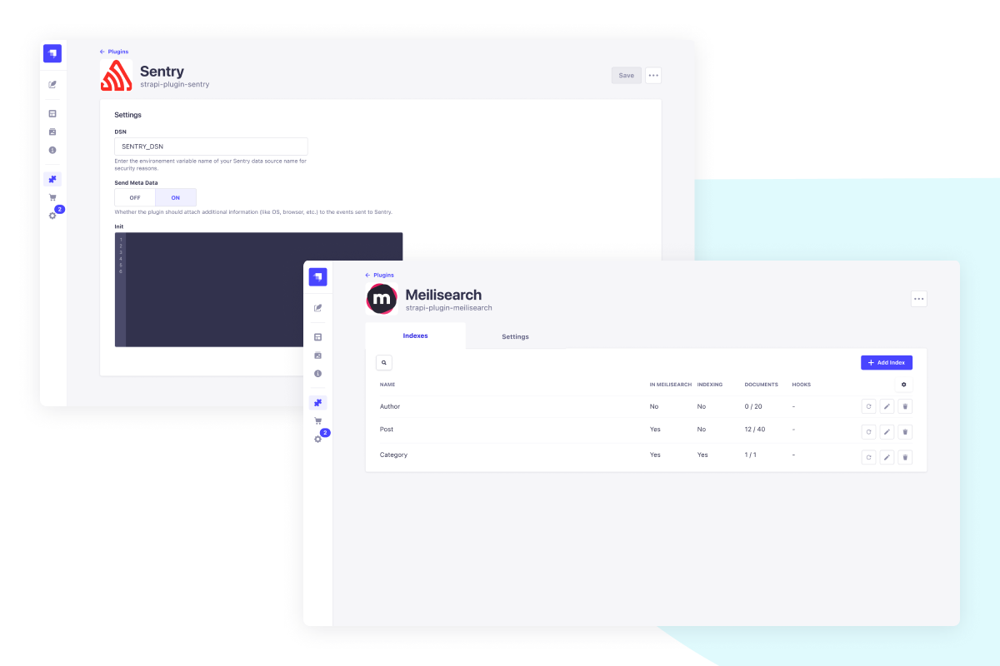
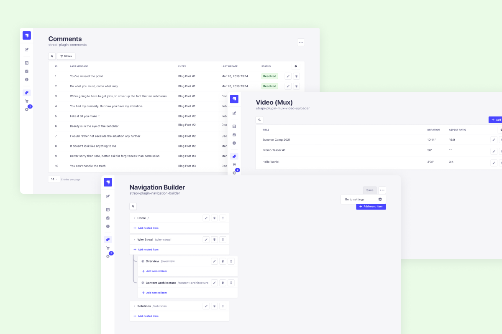
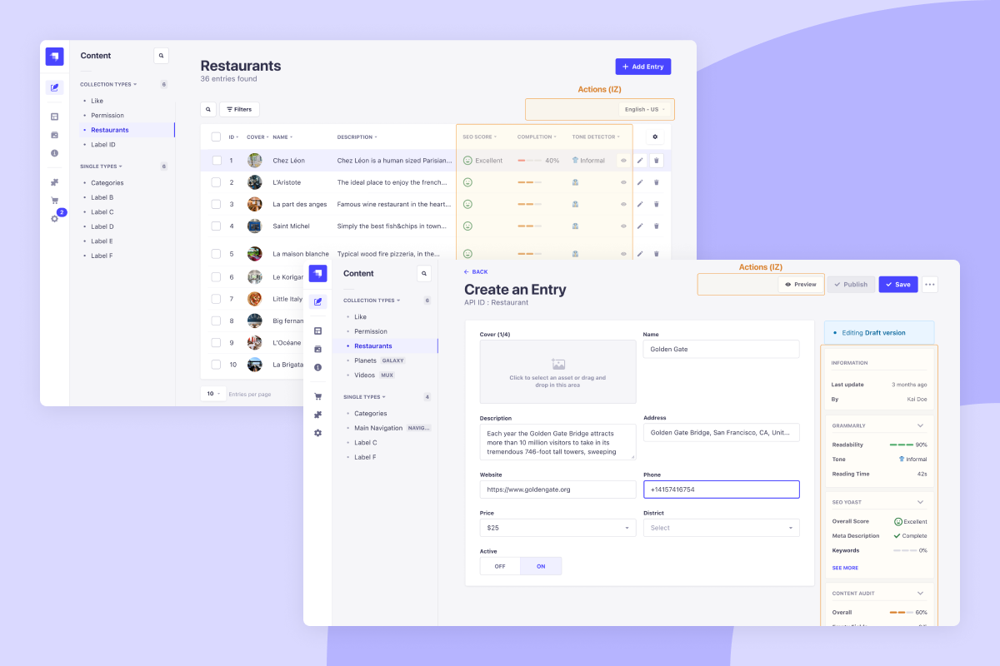

- Start Date: 2021-10-19
- RFC PR: (leave this empty)

# Summary

As part of our effort to promote plugins usage and creation in Strapi, the Expansion Squad (part of the Strapi product team) is working on making plugin development easier and clearer, as well as ensure the best user experience. We are currently working on a validation process to showcase verified plugins on our future web and in-app marketplaces. One of the criteria will be to follow the design guidelines proposed below. 

# Motivation

Strapi's community is growing fast. Its needs are becoming more and more diverse and complex. And more talented developers are jumping in. To unleash this potential we want to create and support a strong plugin ecosystem. This will enable the community to solve specific problems and tap new opportunities. 

To ensure the best experience for plugin users and developers, we would like to introduce design guidelines to provide clarity about what is expected from plugins.

# Detailed design

## Driving principles
- **Clarity**: keep it simple. Use non-tech language. Remove the fluff and keep the essence of what your plugin does.
- **Consistency**: make your plugin part of the whole Strapi experience. It should feel like an extension of it, not a foreign piece of functionality shoved in. Strapi Design System provide more specific guidelines on that topic.
- **Trust**: at the end of the day, users need to trust your plugin with their data and, by extension, their business. Be upfront with what your plugin does and how it does it with clear copy and simple interactions (see [business guidelines]() for more details).

## Impacted User Interfaces

### Plugin Settings

- By default, every plugin has a settings page.
- The plugin configuration should be done as much as possible through the UI to make it more accessible.
- If a plugin requires more than settings, tabs can be added to organize the content (a list of  generated indexes for instance).

### Content Manager

#### Content-types

Plugins managing content for end-users should add collection and single types to the Content Manager. Clues will remind the users that these content-types are coming from a plugin.

#### Injection Zones

To display additional information or allow specific actions in the Content Manager, a plugin should use injection zones to embed simple components, such as a card with texts, or a button.

1. **Actions** in the List View (top-right corner of the list view): This zone is dedicated to buttons, filters, or select inputs. Example: Locale select (Internationalization).
2. **Columns** (one or many columns in the list view): This zone is dedicated to short texts or icon button(s). Example: SEO score (Yoast)
3. **Sidebar** (below the information card in the sidebar of the edit view): This zone is dedicated to any component that fits in a card of the width of the sidebar. Don't try to put too much in it and focus on the key feature of the plugin. Example: Writing style (Grammarly)
- **Actions** in the Edit View (top-right corner of the edit view): This is zone is dedicated to buttons. Example: preview button (Netlify)

## Navigation

As part of the v4 release, many improvements will follow up shortly. Some of them are the way the plugins integrate with the different navigations. Here is how it's going to be:

- Plugin settings will be removed from the settings navigation. They will be accessible from the Plugins screen.
- An icon shows content-types generated by plugins in the Content Manager for more clarity.
- Only users can add plugin shortcuts to the main navigation from the plugin settings. This will prevent an unwanted cluttered navigation and adapt to users preferred configuration.

## Strapi Design System

Strapi's design system provides well-documented design tokens (ex: colors), components (ex: buttons), and patterns (ex: modals) to build a plugin following the the best practices in terms of user experience.

**Note**: Buffet.js is deprecated in v4.

# Tradeoffs

- Constraining the options for a plugin might limit a plugin benefits for some use cases.
- The validation process timing will be longer with a design review and might require changes by the developer (potentially several back and forth) 

# Alternatives

A radical alternative would be to not have any design guidelines.

# Unresolved questions

* Injection zones: what are the use cases?